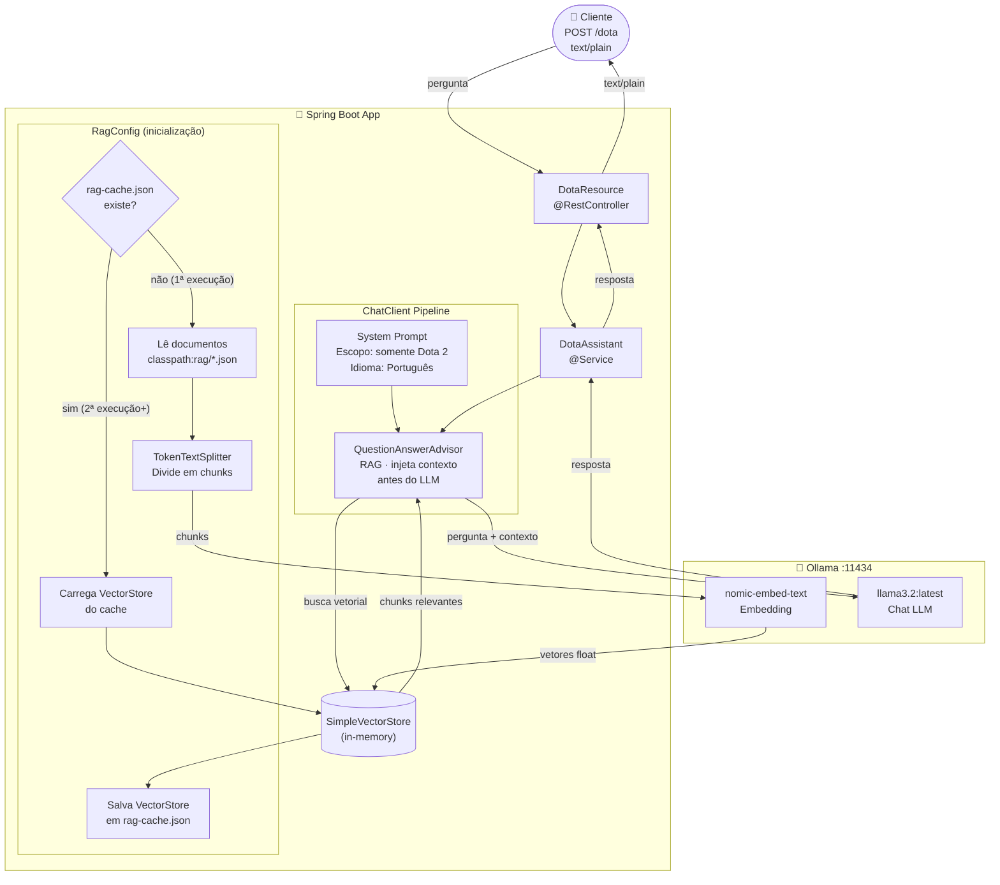

# dota-chatbot

Chatbot de IA especializado em Dota 2, construído com **Spring Boot 3.5.3** e **Spring AI 1.0.0**, utilizando um modelo local via **Ollama** e RAG (Retrieval-Augmented Generation) para responder perguntas sobre heróis, habilidades e o universo do jogo.

## Pré-requisitos

- Java 21+
- [Ollama](https://ollama.com/) instalado e rodando localmente

### Modelos necessários

```bash
ollama pull llama3.2:latest
ollama pull nomic-embed-text
ollama serve
```

## Executando a aplicação

```bash
./mvnw spring-boot:run
```

A aplicação sobe em `http://localhost:8080`.

## Endpoints

| Método | Path | Content-Type | Descrição |
|--------|------|-------------|-----------|
| `POST` | `/dota` | `text/plain` | Envia uma pergunta e recebe a resposta do chatbot |

**Exemplo:**
```bash
curl -X POST http://localhost:8080/dota \
  -H "Content-Type: text/plain" \
  -d "Quais são as habilidades do Axe?"
```

### Documentação da API

- Swagger UI: `http://localhost:8080/swagger-ui.html`
- OpenAPI spec: `http://localhost:8080/api-docs`

## Arquitetura



## Como funciona o RAG

Na primeira inicialização, a aplicação lê os documentos em `src/main/resources/rag/`, gera embeddings via Ollama (`nomic-embed-text`) e salva o índice vetorial em `rag-cache.json` na raiz do projeto. Nas execuções seguintes, o cache é reutilizado, evitando o custo de reindexação.

Para forçar a reindexação, basta deletar o arquivo `rag-cache.json`.

## Build e testes

```bash
# Compilar e empacotar
./mvnw package

# Rodar testes
./mvnw test

# Build + testes
./mvnw verify
```

Os testes usam `@WebMvcTest` com mock do `DotaAssistant`, portanto **não exigem** Ollama rodando.

## Configuração

As propriedades estão em `src/main/resources/application.properties`:

| Propriedade | Padrão | Descrição |
|-------------|--------|-----------|
| `spring.ai.ollama.base-url` | `http://localhost:11434` | URL do Ollama |
| `spring.ai.ollama.chat.options.model` | `llama3.2:latest` | Modelo de chat |
| `spring.ai.ollama.embedding.options.model` | `nomic-embed-text` | Modelo de embedding |
| `app.rag.cache-path` | `./rag-cache.json` | Caminho do cache vetorial |
